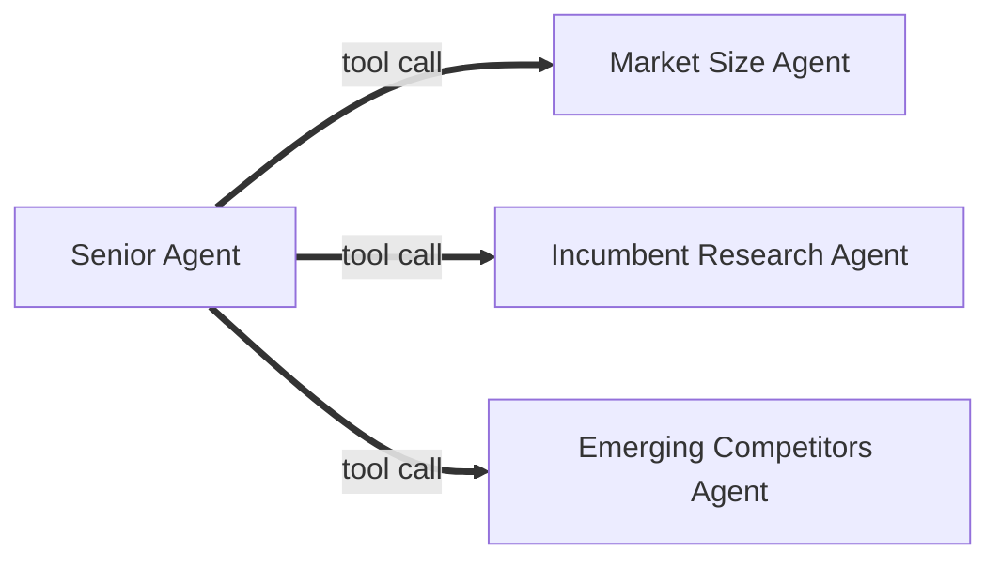

# About

Agentic inference to determine if a company should enter into a given market

## How to run

you need on your system

1.  [uv](https://docs.astral.sh/uv/).
2.  [npm](https://www.npmjs.com/)
3.  python 3.13
4.  a .env file with an api key to [open router](https://openrouter.ai/) OPEN_ROUTER_KEY=
    in the pwd of ./agent/.env
5.  port 8080 open lsof -i:8080

run 
1. ./init-app.sh
2. ./run-app.sh

## Architeture

Uses three sub-agents to do research through a web search tool in the 3 different research fields. Then a senior agent makes a decision based on that report. This tends to produce fewer hallucinations and focus on relevant data. Using a single agent would be faster; however, the data it finds to analyse tends to be more flawed. I found the three-sub-agent approach gave the agent the perfect amount of context to make a decision. Moreover, I found that the more information you gave to the senior agent, the stricter it became.

This runs on a fast api server, which can be query on port http://localhost:8080/analyze

## Limitations

I was unable to integrate with Statista or Forester; I could not get an api key promptly. Furthermore, the experiments I did with public APIs like [our world in data](https://ourworldindata.org/) were unsuccessful. I found making a systematic method to find data on all general markets to be challenging for a single agent to do. In the future, I would like to experiment with an MCP server that can produce more reliable data and apply it to formulas such as TAM and SOM. I chose to use cheaper models as they were more cost-effective. I think that this was the right architecture decision. The senior agent should be given a stricter framework to work against, and the subagents more tools to find data that aligns with the senior agent's framework.

## Reflection

I am very happy with the frontend. I think it looks good, and is not over cluttered. However, I am disappointed with my agent flow. I find the opinions it gives back to be subpar. The senior agent looks at the total addressable market most and makes a decision based on that. It knows that Tim Hortons should not get into nuclear energy. However, the senior agent typically decides that any sizable company should move into a market of sufficient size.
